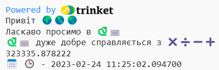
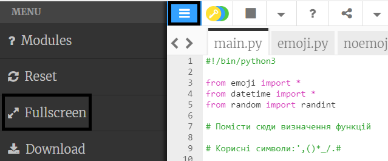

## Цифри та дати

Python відмінно працює з числами та датами.

{:width="300px"}

У Python можна використовувати математичні операції для обчислення сум:

| + | додати |   
| - | відняти |   
| * | множити |   
| / | ділити |   
| ** | піднести до степеня |

--- task ---

Додай ще два рядки `print()` до свого коду, включаючи цифру, яку повинен опрацювати Python:

--- code ---
---
language: python
filename: main.py
line_numbers: true
line_number_start: 12
line_highlights: 14-15
---

print('Привіт', world)   
print('Ласкаво просимо в', python)   
print(python, 'дуже добре справляється з', sums)   
print(230 * 5782 ** 2 / 23781)

--- /code ---

--- /task ---

--- task ---

**Тест:** Запусти свій код. Чи правильно Python порахував суму? Це жарт! Python виконує складні обчислення за тебе, тому можеш не замислюватися над ними.

--- /task ---

Японський вчений інформатики **Емма Харука Івао** використовувала комп'ютер для обчислення числа Пі (*π*) до 31 трильйона цифр. Ця цифра настільки довга, що знадобилося б понад 300 000 років, щоб її вимовити! 

--- task ---

Спробуй змінювати суму, яку обчислює Python, на складнішу!

Ти також можеш використовувати дужки, якщо хочеш керувати послідовністю, в якій Python обчислює суму: `print( (2 + 4) * (5 + 3) )`.

--- /task ---

--- task ---

**Тест:** Запусти свій код та змусь Python обчислити твою суму.

**Налагодження:** Переконайся, що твоя сума оточена лівою та правою круглими дужками `( 2 * 45 )`. Якщо ти використовуєш додаткові дужки для управління послідовністю, переконайся, що кожна права дужка збігається з кожною лівою дужкою.

--- /task ---

--- task ---

Якщо ти змусиш Python обчислити дуже велику суму, то можеш помітити, що відповідь займає декілька рядків у області виведення.

**Порада:** Натисни на **гамбургер-меню** (іконка з трьома лініями) у верхньому лівому кутку редактора Trinket. Далі натисни на кнопку **Fullscreen**, щоб відкрити свій проєкт у повноекранному режимі.

Щоб вийти з повноекранного режиму, знову натисни на кнопку **Fullscreen** або <kbd>Esc</kbd> на клавіатурі.

--- /task ---

Рядок `from datetime import *`, у верхній частині вкладки **main.py** містить бібліотеку з корисними функціями для отримання актуальної дати та часу.

Чудова функція Python полягає в тому, що існують **бібліотеки** кодів, які завжди доступні для використання. Бібліотека Python дозволяє легко використовувати код, написаний іншими людьми. Існують бібліотеки для малювання діаграм та графіків, створення малюнків, розрахунків та багато іншого.

--- task ---

Додай ще один рядок до свого коду, щоб `вивести` більше тексту та змінних емодзі `calendar` або `clock`.

Отримати поточну дату та час можна за допомогою функції `now()` з бібліотеки `datetime`:

--- code ---
---
language: python
filename: main.py
line_numbers: true
line_number_start: 14
line_highlights: 16-17
---

print(python, 'дуже добре справляється з', sums)    
print(230 * 5782 ** 2 / 23781) #Вивести результати обчислення сум     
print(calendar, clock, '-', datetime.now()) #Виведення емодзі

--- /code ---

**Порада:** Тобі не потрібно писати коментарі, вони існують лише для того, щоб допомогти тобі зрозуміти код. Просто введи частину перед `#`.

--- /task ---

--- task ---

**Тест:** Запусти свій код декілька разів, щоб побачити оновлення дати та часу.

**Налагодження:** Переконайся, чи стоїть крапка `.` між `datetime` та `now`. Уважно перевіряй всі пунктуаційні знаки.

--- /task ---

--- save ---
