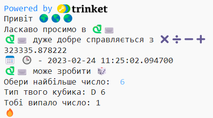

## Підкинь кубик

Python може генерувати випадкові числа для створення цифрового рандомайзера.

{:width="300px"}

У Python ти **викликаєш** **функцію()**, щоб здійснити якусь дію. Функція `print()` вже використовувалась тобою раніше, для виведення тексту.

Ти можеш **визначити** нову **функцію**, щоб згрупувати код разом. Це дозволить дати йому ім'я та повторно його використати.

--- task ---

Функції повинні бути визначені до того, як ти будеш їх викликати. Шукай коментар у верхній частині вкладки **main.py**, де написано `#Визначення функцій розміщуй тут`.

Визнач нову функцію з назвою `roll_dice()` яка використовує функцію `randint()`, з бібліотеки `random`, щоб згенерувати випадкове 'натуральне' (ціле) число від 1 до 6 та вивести його на екран.

--- code ---
---
language: python filename: main.py line_numbers: true line_number_start: 7
line_highlights: 9-12
---

# Помісти сюди визначення функцій

def roll_dice(): #Don't forget the colon at the end of this line   
print(python, 'can make a', dice)   
print('You rolled a', randint(1, 6))

--- /code ---

Рядки під `def roll_dice():` мають **абзацний відступ**. Щоб зробити це, скористайся кнопкою <kbd>Tab</kbd> на клавіатурі (зазвичай знаходиться над <kbd>CAPSLOCK</kbd>). Код з абзацними відступами вказує Python, що рядки з абзацними відступами є частиною функції.

**Порада:** Символ підкреслення `_` використовується між словами в назвах змінних та функцій у Python, щоб спростити їх читання. Не можна використовувати пробіл.

--- collapse ---
---
title: Набір спеціальних символів на англійській розкладці клавіатури
---

На англійській розкладці клавіатури, двокрапка `:` знаходиться на тій самій клавіші, що і крапка з комою, справа від клавіші <kbd>L</kbd>: утримуй <kbd>Shift</kbd> та натисни на <kbd>;</kbd>, щоб отримати `:`. Символ підкреслення `_` знаходиться на тій самій клавіші, що й `-`, справа від <kbd>0</kbd>, утримуй <kbd>Shift</kbd> та натисни на <kbd>-</kbd>, щоб отримати `_`.

--- /collapse ---

--- /task ---

--- task ---

**Тест:** Якщо запустити твій код зараз, він не спрацює. Це тому, що функція `roll_dice()` була визначена, але ще не викликана.

--- /task ---

--- task ---

Щоб використати функцію, потрібно викликати її безпосередньо в коді. Перейди в кінець коду та додай новий рядок, щоб викликати функцію `roll_dice()`:

--- code ---
---
language: python filename: main.py line_numbers: true line_number_start: 20
line_highlights: 22
---

print('The', calendar, clock, 'is', datetime.now())

roll_dice() #Call the roll dice function

--- /code ---

--- /task ---

--- task ---

**Тест:** Запусти свій проєкт декілька разів, щоб побачити випадіння випадкового числа кожного разу.

**Налагодження:** Переконайся, що у коді є підкреслення `_` між roll та dice, щоб назва функції створилась коректно. Переконайся, що у коді є двокрапка `:` наприкінці рядка.

**Налагодження:** Переконайся, щоб рядки під `def roll_dice()` мали відступи. У Python дуже часто трапляються такі помилки, тому обов'язково слід перевіряти це.

--- /task ---

Використання випадкових чисел включає криптографію, науку про дані, а також внесення різноманітності в ігри та програмне мистецтво. Комп'ютери генерують **випадкові числа** за допомогою алгоритму. Для чисел, які дійсно є випадковими, потрібен абсолютно непередбачуваний вхідний сигнал з реального світу.

--- task ---

Змінна `fire` містить емодзі 🔥. Код `print(fire * 3)` виведе 3 емодзі вогню '🔥🔥🔥'. Тобі необхідно вивести правильну кількість емодзі, яка відповідає випадаючому числу.

--- collapse ---
---
title: Що буде, якщо використати код `print(fire * randint(1, 6))`?
---

Ти отримаєш нове випадкове число, яке, як правило, буде відрізнятися від першого випадкового числа.

--- /collapse ---

Хм, а як можна переконатися, що використовується одне й те саме випадкове число?

Зміни код для збереження значення, що повертатиметься за допомогою `randint()` у змінній з назвою `roll` та використовуй цю змінну, щоб вивести число, яке випало з відповідною кількістю емодзі 🔥.

--- code ---
---
language: python filename: main.py line_numbers: true line_number_start: 7
line_highlights: 11 - 13
---

# Помісти сюди визначення функцій

def roll_dice():    
print(python, 'can make a', dice)    
roll = randint(1, 6) #Generate a random number between 1 and 6    
print('You rolled a', roll) #Print the value of the roll variable     
print(fire * roll) #Repeat the fire emoji to match the dice roll

--- /code ---

Ти можеш використовувати `star` або `heart` замість `fire`, якщо захочеш.

Символ `*` означає помножити, отже `fire * roll` помножить текст у змінній ('🔥') `fire` відповідно до числа, яке міститься в змінній `roll`.

--- /task ---

--- task ---

**Тест:** Протестуй свій проєкт кілька разів. Переконайся, що ти розумієш, як працює код.

**Порада:** Змінні корисні, коли потрібно використовувати одне й те ж саме значення кілька разів у коді. Надання змінним логічних імен також полегшує розуміння коду.

--- /task ---

Вдосконалюй свій кубик так, щоб у користувача була можливість вибрати максимальне число.

У багатьох іграх використовується багатогранний кубик. У реальному світі кубики виготовляються зі звичайних геометричних фігур. Популярні види кубиків - D6, D12 і D20. На комп'ютері, ти можеш згенерувати випадкове число, щоб зробити чесний кубик з будь-якою кількістю сторін.

--- task ---

Функція `input()` задає користувачу питання, а потім отримує його відповідь.

Додай код, який буде запитувати у користувача найбільше число для його кубика, а потім збереже результат у змінну з іменем `max` та зробить `print` вибраного числа у вихідну область:

--- code ---
---
language: python filename: main.py line_numbers: true line_number_start: 7
line_highlights: 11-12
---

# Помісти сюди визначення функцій

def roll_dice():   
print(python, 'can make a', dice)   
max = input('How many sides?:') #Wait for input from the user    
print('That\'s a D', max) #Use the number the user entered    
roll = randint(1, 6)    
print('You rolled a', roll)    
print(fire * roll)

--- /code ---

To print an apostrophe `'` in a word like `That's`, put a backslash `\` before it so Python knows it's part of the text.

--- /task ---

--- task ---

Зміни код змінної `roll`, щоб використовувати `max` як максимальне значення для `randint` при генерації випадкового числа.

Коли користувач вводить вхідні дані, Python розглядає їх як текст. Але, `randint` потребує 'ціле' (позитивне ціле число). Функція `int` перетворює введені користувачем дані в ціле число.

--- code ---
---
language: python filename: main.py line_numbers: true line_number_start: 7
line_highlights: 13
---

# Помісти сюди визначення функцій

def roll_dice():   
print(python, 'can make a', dice)   
max = input('How many sides?:') #Wait for input from the user   
print('That\'s a D', max) #Use the number the user entered   
roll = randint(1, int(max)) #randint needs max to be an 'integer'   
print('You rolled a', roll)   
print(fire * roll)

--- /code ---

--- /task ---

--- task ---

**Тест:** Запусти свій проєкт. Коли програма дійде до рядка `input`, вона буде чекати, поки користувач введе відповідь і потім продовжить роботу. Спробуй ще раз з іншим `вхідним` числом.

--- /task ---

--- save ---
