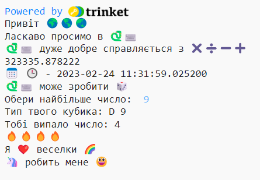

## Початок речення

Виведи більше речень з твого проєкту.

{:width="300px"}

--- task ---

Додай більше рядків `print` до твого коду. Ось деякі речення, які ти можеш використати для початку:

--- code ---
---
language: python
filename: main.py
---

print('I', heart, '...')   
print('... makes me', happy)   
print('I\'d like to make ... with', python)

--- /code ---

**Порада:** `print` додає пробіл між кожним надрукованим елементом.

**Порада:** Якщо потрібно надрукувати апостроф `'`, необхідно ввести символ бекслэш `\` перед апострофом, щоб Python знав, що це частина тексту.

--- /task ---

емодзі жовтого серця часто використовується, щоб зобразити дружбу та щастя.

--- task ---

Яке повідомлення хочеш надіслали другу, щоб підняти йому настрій? Який емодзі ти вибереш?

Натисни на вкладку **emoji.py** у Trinket, щоб побачити змінні емодзі, які ти можеш використовувати. Повернись на вкладку **main.py**, щоб додати їх до свого коду.

Ти можеш додати більше змінних емодзі для **emoji.py**. Використовуй цей [список емодзі](https://unicode.org/emoji/charts/full-emoji-list.html){:target="_blank"}, щоб знайти потрібні тобі емодзі.

--- /task ---

--- save ---
