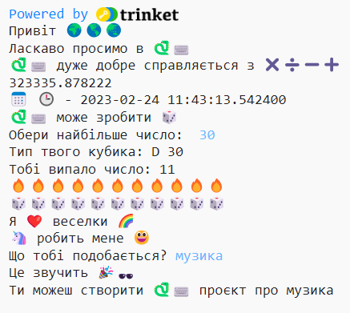

## Вдосконалення твого проєкту

Доповни свій проєкт. There are more emojis to choose from.
  

{:width="300px"} 

Ти можеш:
+ Використовувати різній текст та емодзі для `print`
+ Використовувати `input`, щоб отримувати значення від користувача та зберігати їх як змінні, а потім виконувати обчислення зі змінними
+ Напиши більше функцій, щоб організувати свій код
+ Використовуй `#`, щоб додати коментарі до коду

Scroll to the **emoji** section in the code editor to see the emojis and example variables that you can use. Copy the ones you choose and save them to a variable or add them directly to your code.

**Tip:** To add emojis, find the comment # Emojis to copy and paste into your code. Copy the emojis you want to use then paste them into your code.

🎊 🙌 🙌🏼 🙌🏽 🙌🏾 🙌🏿 # 😃 🕒🎨🎮🔬🎉🕶️🎲 😊 🦄🚀💯⭐💛❤️📚⚽🏏🏀🥋🏆✨🥺🌈🔥♻️🌳 👩‍🦽👩🏼‍🦽👩🏽‍🦽👩🏾‍🦽👩🏿‍🦽🧘 🧘🏼 🧘🏽 🧘🏾 🧘🏿 🙋🙋🏼🙋🏽🙋🏾🙋🏿

[[[choose-an-emoji]]]

def hobbies():   
hobby = input('Що тобі подобається?')   
print('Це звучить', fun)   
print('Ти можеш створити', python, 'проєкт про', hobby)

--- code ---
---
language: python
filename: main.py
---

# Розмісти код для виконання тут
Ти можеш використовувати `input`, щоб змусити свій проєкт чекати, поки користувач натисне на <kbd>Enter</kbd>, на будь-якому етапі проєкту.

--- /code ---

**Tip:** Don't forget you will need to call your function as well as define it.

You can use `input` to make your project wait for the user to tap <kbd>Enter</kbd> at any point in this project.

--- code ---
---
language: python
filename: main.py
---

roll_dice()

input()  # Wait for the user to tap Enter

Ти можеш переглянути [завершений проєкт тут](https://trinket.io/embed/python/dff729ae04){:target="_blank"}.

--- /code ---

--- collapse ---
---
title: Завершений проєкт
---

You can view the [completed project here](https://editor.raspberrypi.org/en/projects/hello-world-solution){:target="_blank"}.

--- /collapse ---

--- save ---
