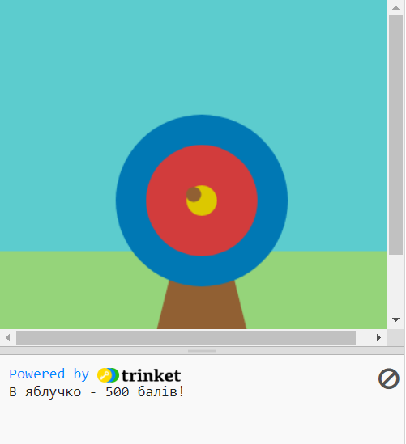

## Що далі?

Якщо ти йдеш по мануалу [Знайомство з Python](https://projects.raspberrypi.org/en/raspberrypi/python-intro), можеш перейти до проєкту [Стрільба по мішені](https://projects.raspberrypi.org/en/projects/target-practice). У цьому проєкті ти намалюєш мішень, а потім зробиш гру, в якій будеш стріляти з лука, щоб набрати бали.

--- print-only ---

--- /print-only ---

--- no-print ---

<iframe src="https://trinket.io/embed/python/f686c82d8a?outputOnly=true&start=result" width="600" height="500" frameborder="0" marginwidth="0" marginheight="0" allowfullscreen>
</iframe>

--- /no-print ---

Якщо ти хочеш отримати більше задоволення від вивчення Python, спробуй один з [цих проєктів](https://projects.raspberrypi.org/en/projects?software%5B%5D=python).
