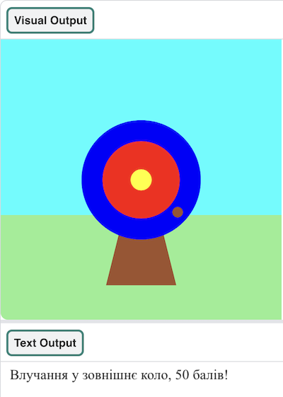

## Що ти тепер вмієш?

Якщо ти йдеш напрямом [Вступ до Python](https://projects.raspberrypi.org/uk-UA/raspberrypi/python-intro), можеш перейти до проєкту [Влучний постріл](https://projects.raspberrypi.org/uk-UA/projects/target-practice). У цьому проєкті ти намалюєш мішень і зробиш гру, в якій будеш стріляти з лука й отримувати бали.

--- print-only ---

{:width="640px"}

--- /print-only ---

--- no-print ---

Натисни кнопку **Run**, щоб побачити приклад цього проєкту.

<iframe src="https://editor.raspberrypi.org/uk-UA/embed/viewer/target-practice-solution" width="600" height="600" frameborder="0" marginwidth="0" marginheight="0" allowfullscreen>
</iframe>

--- /no-print ---

Або чому б не спробувати інший проєкт у [Python](https://projects.raspberrypi.org/uk-UA/projects?software%5B%5D=python)?

